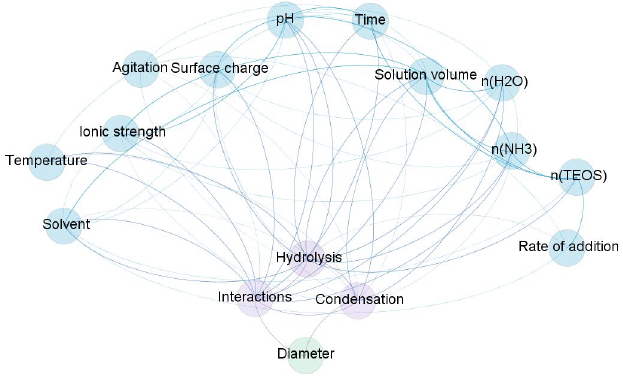

## Stöber method

The [Stöber classical method](https://doi.org/10.1016/0021-9797(68)90272-5) is based on the base-catalyzed hydrolysis and condensation of Tetraethyl orthosilicate (TEOS; Si(OC2H5)4) in a batch reactor to obtain sílica (SiO2) particles with spherical morphology and monosized distribution. In general, a solution of ammonium hydroxide and water is mixed with alcohol under mild stirring at a constant temperature. Then, the TEOS is added to the mixture and is left to react until the formation of stable particles with a constant size. Then particles are separated from the solution using centrifugation and the collected final particles are washed with water and alcohol to remove unreacted reagents. Finally, they are dried at room temperature for further characterization studies, such as diameter and dispersion measurement. The size measures retrieved are determined via electron microscopies such as TEM (Transmission Electron Microscopy) and SEM (Scanning Electron Microscopy) and some other techniques such as SAXS (Small-Angle X-ray Scattering) and DLS (Dynamic Light Scattering).

The Stöber synthesis provides calibrated and monodispersed silica particles, is robust and scalable thanks to the simplicity of the method. Even with relatively few experimental parameters, there is no consensus on the relevance of different synthesis factors on the final diameter, and no model considers the totality of experimental results. A network representation was constructed considering the main reactions involved: hydrolysis, condensation, and interactions. The importance of each relationship between variables that influence the synthesis was defined based on previous works, leading to a highly connected network diagram.

